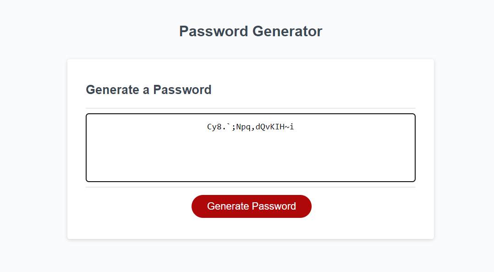

Repository contains quality README file with description, screenshot, and link to deployed application.

Password Generator is a webpage designed to generate a password based on various selected criteria including uppercase, lowercase, numbers, special characters, and length.

Link to deployed page : https://rachelgray7448.github.io/password-generator/
